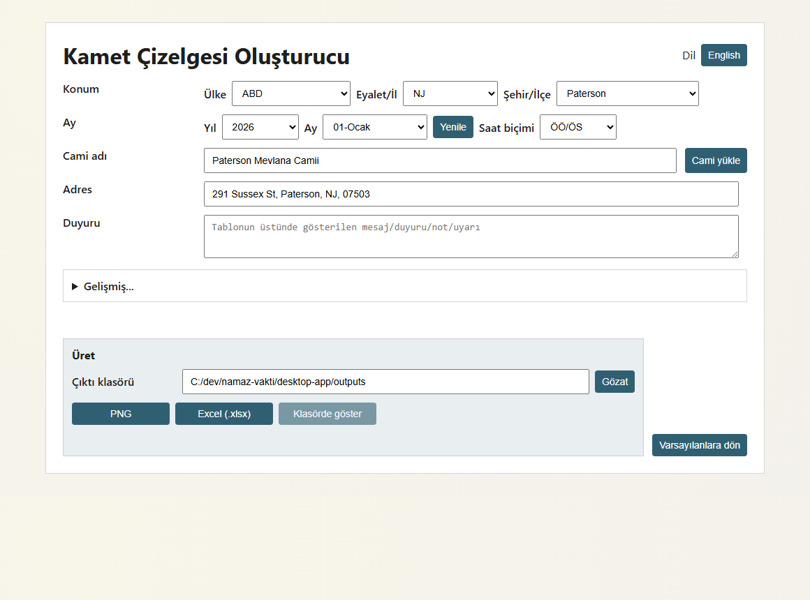
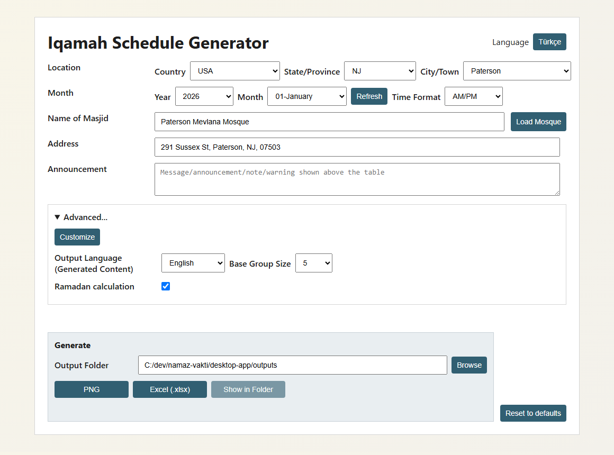
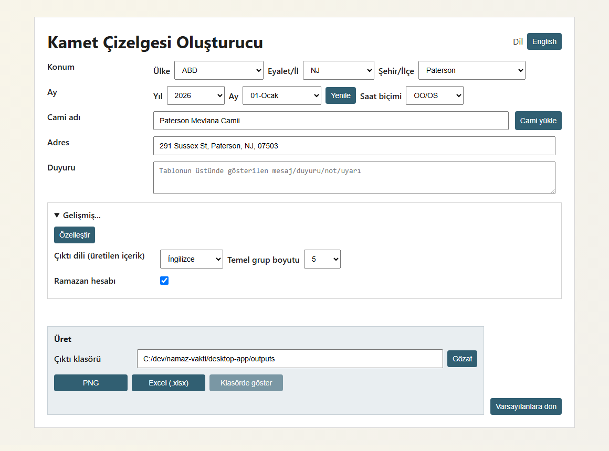
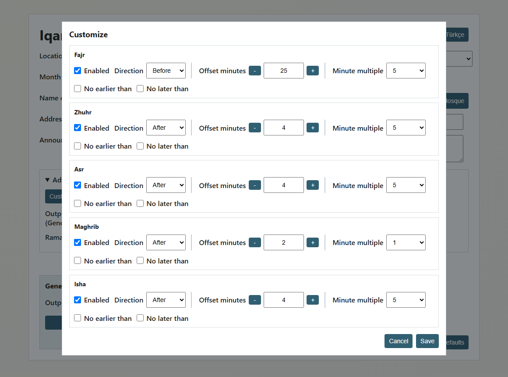
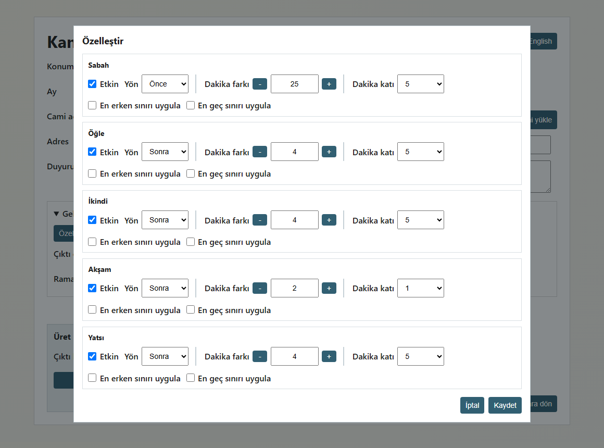
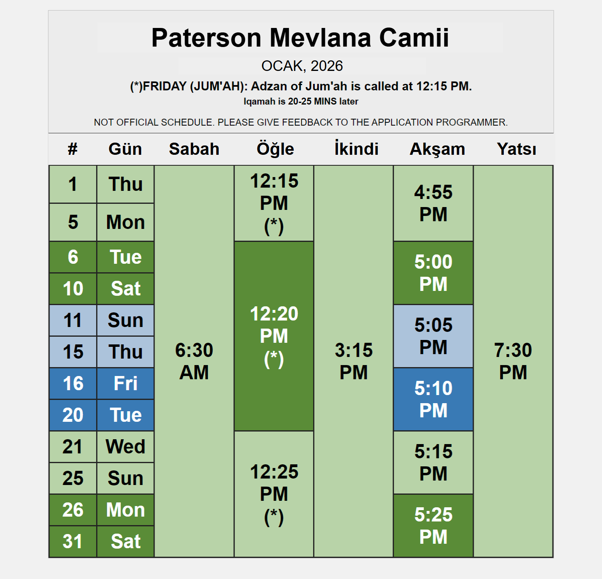
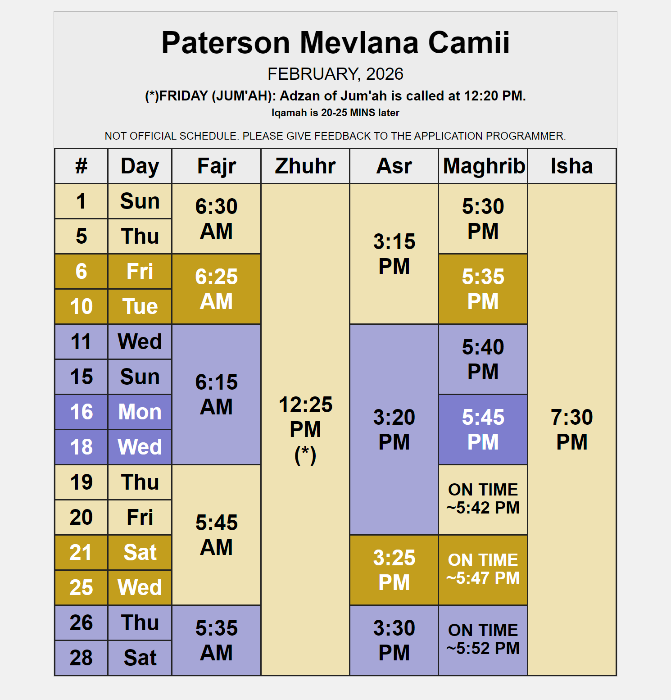

# Namaz Vakti Desktop Skeleton (Option 1)

Electron + Node + template-first XLSX generation skeleton for:
- Read monthly TSV (`paterson_YYYY-MM.tsv`)
- Compute grouped iqamah times
- Export XLSX and PNG

## Folder Layout

```text
desktop-app/
  assets/
    templates/
      README.md
  src/
    domain/
      types.ts
      iqamah-rules.ts
      optimizer.ts
      grouping.ts
      pipeline.ts
    main/
      index.ts
      ipc-handlers.ts
    preload/
      index.ts
    renderer/
      index.html
      src/
        main.ts
        global.d.ts
    services/
      tsv-reader.ts
      xlsx-writer.ts
      png-renderer.ts
      template-map.ts
    shared/
      ipc.ts
  electron.vite.config.ts
  package.json
  tsconfig.json
```

## IPC Contracts

Defined in `src/shared/ipc.ts`:
- `listMonths(tsvFolder) -> string[]`
- `previewMonth(options) -> PreviewMonthResponse`
- `generateOutputs(options) -> { xlsxPath, pngPath, warnings }`
- `selectTsvFolder() -> string | null`
- `selectOutputFolder() -> string | null`
- `selectTemplateFile() -> string | null`

`GenerationOptions` includes:
- `month` (`YYYY-MM`)
- `tsvFolder`, `outputFolder`, `templateFile`
- `locale` (`en|tr`), `timeFormat` (`ampm|24h`)
- `baseGroupSize` (`5|10|15`)

## Algorithm Interfaces

`src/domain/iqamah-rules.ts`
- Rule definitions per prayer
- Base group-size validation

`src/domain/optimizer.ts`
- `buildBaseGroups(days, size)`
- `optimizeIqamahForPrayer(days, rule)`
- `optimizeGroups(baseGroups, rules)`

`src/domain/grouping.ts`
- `collapseAdjacentSameGroups(groups)`
- `assignColorTokens(baseGroups, theme)`

`src/domain/pipeline.ts`
- `buildMonthlyPlan(input)` orchestrates full flow:
  parse minutes -> base groups -> optimize -> collapse -> color sequence.

## Implementation Notes

- Optimizer enforces prayer constraints (`>= +offset` for zhuhr/asr/maghrib/isha, `<= -offset` from sunrise for fajr) and applies 5-minute quantization except maghrib.
- XLSX writer now uses concrete `Odd`/`Even` sheet maps from the provided template and preserves template styles by copying source row styles.
- PNG export is generated from a hidden offscreen BrowserWindow for deterministic capture.

## Application Screenshots

The following screenshots show the same application state in English and Turkish. The language switch changes the user interface labels while the generated-output language remains an independent setting in the Advanced section.

### Basic window

The basic window provides the location, month, mosque information, announcement, and output controls without expanding the advanced settings.

| English | Turkish |
| --- | --- |
|  |  |

### Advanced section opened

The Advanced section exposes the generated-content language, base group size, Ramadan calculation option, and the entry point to prayer-time customization.

| English | Turkish |
| --- | --- |
|  |  |

### Customize window opened

The Customize dialog lets each prayer be enabled or disabled and adjusts its direction, minute offset, rounding multiple, and optional earliest/latest limits.

| English | Turkish |
| --- | --- |
|  |  |

### Schedule snapshots

These examples show the exported schedule layout for an odd-numbered month (January 2026) and an even-numbered month (February 2026). The odd-month example displays Turkish schedule headings; the even-month example keeps the English output labels. The alternating colored blocks represent groups of days that share the same calculated iqamah values.

| Odd month — Turkish output | Even month — English output |
| --- | --- |
|  |  |

## Run

```bash
cd desktop-app
npm install
npm run dev
```

## Next Coding Step

1. Finalize template mapping (`src/services/template-map.ts`) using named ranges or stable coordinates.
2. Implement full XLSX write logic in `src/services/xlsx-writer.ts`.
3. Render a dedicated print view for PNG export.
4. Add unit tests around `optimizer.ts` and `grouping.ts`.
